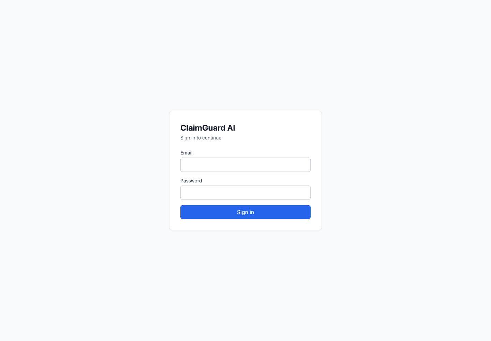
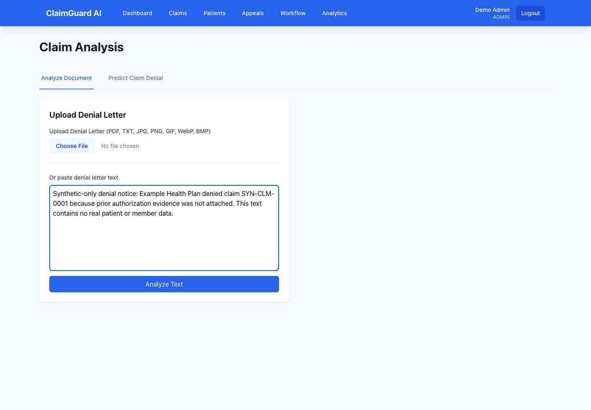
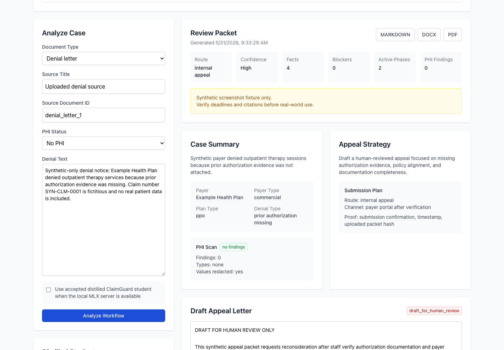

# ClaimGuard AI - Healthcare Claim Denial Prediction, Medical Billing Appeals, and HIPAA-Safe LLM Distillation

ClaimGuard AI is architected by Raphael Malikian <rtmalikian@gmail.com>.

ClaimGuard AI is a healthcare revenue-cycle AI project for medical billing
teams, clinicians, and healthcare operators who need safer claim denial
prediction, denial-letter review, appeal workflow support, and controlled LLM
distillation for insurance denial and appeal work.

SEO description: healthcare AI for claim denial prediction, medical billing
appeals, insurance denial analysis, denial letter automation, RCM workflow
support, HIPAA-safe PHI controls, synthetic denial/appeal corpus generation,
and clinician-readable LLM distillation.

## What This Project Does

- Predicts denial risk before a claim is submitted.
- Explains denial risk using billing-focused driver categories such as coding,
  missing authorization, documentation gaps, timeliness, eligibility, and payer
  policy conflicts.
- Helps staff review denial letters and draft appeal or correction packets.
- Keeps generated appeal content gated for human review and not filing-ready.
- Uses synthetic and reviewed training artifacts for local model development.
- Adds PHI/PII scanning, de-identification gates, corpus review gates,
  retrieval governance, student-model cutover controls, and production
  readiness reports.
- Documents a local LLM distillation path so a smaller student model can learn
  the denial and appeal workflow without making external APIs the default for
  every future step.
- **ChromaDB vector retrieval (added June 2026):** persistent vector storage
  with HNSW approximate nearest-neighbor search for semantic retrieval of
  denial/appeal rules, payer policies, and corpus documents. Replaces
  in-memory-only retrieval for production use.

## Screenshots

Screenshots are generated with Playwright from the local UI and stored in
`docs/screenshots/`.







## Clinician-Friendly Project Walkthrough

For a plain-language breakdown of how ClaimGuard AI was built, including the
denial workflow, PHI safeguards, synthetic corpus, LLM distillation process,
student model gates, and why production approvals remain separate from local
experiments, read:

[Clinician guide to how ClaimGuard AI was created](docs/clinician-project-build-guide.md)

For a more technical breakdown of the LLM distillation process, including
analysis statistics, corpus coverage, benchmark evidence, validation tools, and
remaining production gates, read:

[Technical LLM distillation breakdown and analysis statistics](docs/technical-llm-distillation-analysis.md)

## Repository Map

- `health-ai-medical-billing-medical-corporations-20260414_180528/` - the
  FastAPI, React, Docker, and test application.
- `health-ai-medical-billing-medical-corporations-20260414_180528/app/services/retrieval_chroma.py` -
  ChromaDB vector retrieval index with HNSW, metadata filtering, hybrid search,
  and seed utilities for CMS/DOL/Medicare/Medicaid/HIPAA rule chunks.
- `health-ai-medical-billing-medical-corporations-20260414_180528/scripts/seed_chroma.py` -
  CLI script to bootstrap ChromaDB with default appeal rule chunks.
- `llm-distill/` - distillation plans, synthetic denial/appeal data, validators,
  model-readiness evidence, and PHIplan production-readiness reports.
- `denial_skill/` - denial and appeal workflow decomposition, schema, prompt,
  template, and evaluation package.
- `PHIplan.md` - active PHI, corpus, model-improvement, retrieval, runtime, and
  production-readiness implementation plan.
- `CHANGELOG.md` - root-level rollback-ready implementation history.

## Safety Status

The current checked-in state is conservative by design:

- Student-model routing is integrated but not production-default.
- Real user-data model improvement remains disabled unless legal, BAA, consent,
  approval reference, and per-request gates are configured outside source
  control.
- **ChromaDB vector retrieval is now integrated** as a local persistent vector
  backend with HNSW search. The default appeal rule chunks (CMS, DOL, Medicare,
  Medicaid, HIPAA) are seeded. Semantic search quality improves significantly
  when a real embedding model (e.g., OpenAI text-embedding-3-small or a local
  sentence-transformers model) replaces the hash embedding fallback. Set
  `RETRIEVAL_VECTOR_BACKEND=chroma` to enable.
- Production corpus readiness remains blocked until approved non-synthetic
  denial/appeal pairs are reviewed outside source control.
- Production prediction-threshold calibration and fairness monitoring remain
  blocked until approved outcome data, monitoring ownership, latest-run
  evidence, and legal/privacy review are complete outside source control.

This repository should not be treated as medical advice, legal advice, payer
policy advice, or a filing-ready appeal system. Human billing, clinical,
privacy, and legal review remain required.

## Quick Start

The application lives under
`health-ai-medical-billing-medical-corporations-20260414_180528/`.

```bash
cd health-ai-medical-billing-medical-corporations-20260414_180528
docker compose up -d
```

Local app URLs:

- Frontend: `http://localhost:5173`
- API docs: `http://localhost:8001/docs`

Keep `.env` files private. Do not commit API keys, encryption keys, passwords,
approval references, production documents, PHI, or raw claim data.

## Documentation

- [Application README](health-ai-medical-billing-medical-corporations-20260414_180528/README.md)
- [LLM distillation README](llm-distill/README.md)
- [Technical LLM distillation breakdown and analysis statistics](docs/technical-llm-distillation-analysis.md)
- [Clinician guide to how ClaimGuard AI was created](docs/clinician-project-build-guide.md)
- [PHI safeguards and production-readiness plan](PHIplan.md)
- [Denial workflow skill package](denial_skill/README.md)
- [API authentication and authorization](health-ai-medical-billing-medical-corporations-20260414_180528/docs/api-authentication.md)
- [EDI format notes](health-ai-medical-billing-medical-corporations-20260414_180528/docs/edi-formats.md)
- [Deployment guide](health-ai-medical-billing-medical-corporations-20260414_180528/docs/deployment-guide.md)
- [Backup and disaster recovery](health-ai-medical-billing-medical-corporations-20260414_180528/docs/backup-disaster-recovery.md)

## Vector Retrieval (ChromaDB)

ClaimGuard AI uses ChromaDB for persistent vector storage with HNSW
approximate nearest-neighbor search. This powers semantic retrieval of
denial/appeal rules, payer policies, and training corpus documents.

### Bootstrap

```bash
cd health-ai-medical-billing-medical-corporations-20260414_180528
pip install chromadb sentence-transformers torch

# Seed rule chunks (6 CMS/DOL/Medicare/Medicaid/HIPAA rules)
CLAIMGUARD_EMBEDDING_BACKEND=sentence_transformer python scripts/seed_chroma.py

# Seed corpus (10K denial letters + 10K appeal drafts)
CLAIMGUARD_EMBEDDING_BACKEND=sentence_transformer python scripts/seed_corpus_chroma.py
```

### Configuration

| Env Var | Default | Description |
|---------|---------|-------------|
| `RETRIEVAL_VECTOR_BACKEND` | `encrypted_local_metadata` | Set to `chroma` to enable ChromaDB |
| `CLAIMGUARD_CHROMA_DIR` | `data/chroma_db/` | ChromaDB persist directory |
| `RETRIEVAL_EMBEDDING_BACKEND` | `hash` | `hash` (fallback), `sentence_transformer` (local semantic), or `private_semantic` |
| `CLAIMGUARD_EMBEDDING_BACKEND` | `hash` | Used by seed script: `sentence_transformer` for local semantic embeddings |
| `RETRIEVAL_EMBEDDING_MODEL` | `claimguard-hash-embedding-v1` | Embedding model name |
| `RETRIEVAL_PRIVATE_EMBEDDING_URL` | — | OpenAI-compatible embedding endpoint |
| `RETRIEVAL_PRIVATE_EMBEDDING_DIMENSIONS` | — | Vector dimensions for the embedding model |

### Collections

| Collection | Contents |
|------------|----------|
| `claimguard_rules` | CMS, DOL, Medicare, Medicaid, HIPAA appeal rule chunks (6) |
| `claimguard_corpus` | 10K synthetic denial letters from teacher distillation corpus |
| `claimguard_appeals` | 10K synthetic appeal drafts from teacher distillation corpus |

### Search Modes

- `search_mode="keyword"` — BM25-style keyword matching (in-memory)
- `search_mode="embedding"` — vector cosine similarity (in-memory hash)
- `search_mode="hybrid"` — keyword + embedding fusion (in-memory)
- `search_mode="chroma"` — persistent ChromaDB HNSW search (recommended)

The GitHub-facing README and technical distillation breakdown are checked by
`python3 llm-distill/scripts/validate_public_repo_docs.py --fail-on-blocked`
so the public link, analysis statistics, tool list, attribution, and redacted
documentation posture do not silently drift.

## Commercial License And Use Restrictions

This project is source-available under a commercial license, not open source
for commercial use. You may view the repository for evaluation and educational
review, but you may not copy, fork, deploy, resell, redistribute, train on,
commercialize, or use it in a commercial setting without written permission
from Raphael Malikian.

Read [LICENSE](LICENSE) before using any part of this project.

## Support, Donations, And Collaboration

If this work helps you, or if you want to support continued healthcare AI and
medical billing automation research, email Raphael Malikian at
<rtmalikian@gmail.com> with the subject line `ClaimGuard AI support`.

If your clinic, billing team, startup, or healthcare organization has a denial,
appeal, revenue-cycle, documentation, or AI workflow problem you want help
solving, Raphael is available to collaborate. Contact:

Raphael Malikian  
Email: <rtmalikian@gmail.com>
